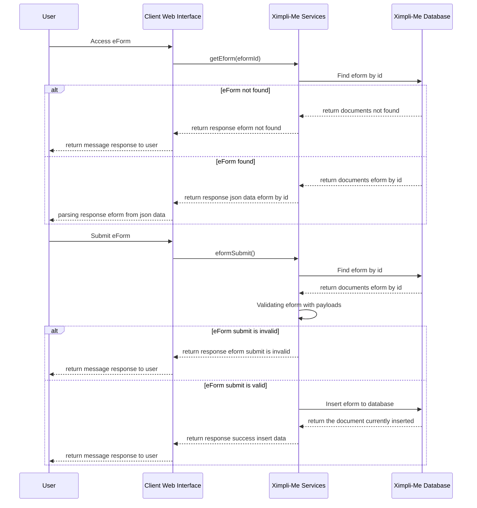

# Concepts

Eforms can be accessed and submitted through the API. The following sequence diagram illustrates the process of accessing and submitting an eform.

```mermaid
sequenceDiagram
    participant User
    participant ClientWebInterface as Client Web Interface
    participant XimpliMeServices as Ximpli-Me Services
    participant XimpliMeDatabase as Ximpli-Me Database

    User->>ClientWebInterface: Access eForm
    ClientWebInterface->>XimpliMeServices: getEform(eformId)
    XimpliMeServices->>XimpliMeDatabase: Find eform by id

    alt eForm not found
        XimpliMeDatabase-->>XimpliMeServices: return documents not found
        XimpliMeServices-->>ClientWebInterface: return response eform not found
        ClientWebInterface-->>User: return message response to user
    else eForm found
        XimpliMeDatabase-->>XimpliMeServices: return documents eform by id
        XimpliMeServices-->>ClientWebInterface: return response json data eform by id
        ClientWebInterface-->>User: parsing response eform from json data
    end

    User->>ClientWebInterface: Submit eForm
    ClientWebInterface->>XimpliMeServices: eformSubmit()
    XimpliMeServices->>XimpliMeDatabase: Find eform by id
    XimpliMeDatabase-->>XimpliMeServices: return documents eform by id
    XimpliMeServices->>XimpliMeServices: Validating eform with payloads

    alt eForm submit is invalid
        XimpliMeServices-->>ClientWebInterface: return response eform submit is invalid
        ClientWebInterface-->>User: return message response to user
    else eForm submit is valid
        XimpliMeServices->>XimpliMeDatabase: Insert eform to database
        XimpliMeDatabase-->>XimpliMeServices: return the document currently inserted
        XimpliMeServices-->>ClientWebInterface: return response success insert data
        ClientWebInterface-->>User: return message response to user
    end
``` 